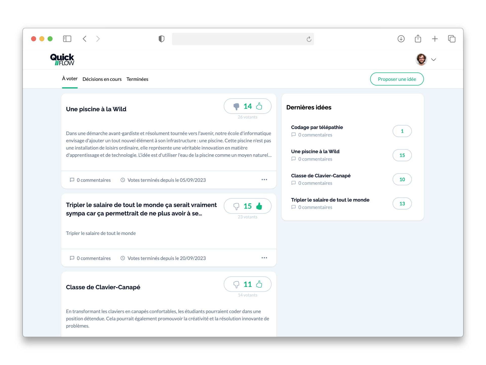

<div align="center">
  
  
  <h3>QuickFlow</h3>
  
  <p>
    A collaborative decision-making platform designed to streamline organizational proposals, voting, and consensus building.
  </p>
</div>

<div align="center">
  
</div>

<br />

## ✨ Core Features

*   **Collaborative Idea Management**: Users can submit, edit, and track the lifecycle of ideas and proposals within their organization.
*   **Advanced Voting System**: Weighted voting mechanisms and real-time status tracking (Open, Accepted, Refused) to democratize decision-making.
*   **Organization Hubs**: Create or join dedicated organization spaces to compartmentalize workflows and teams.
*   **Role-Based Access Control**: Granular permissions for Administrators, Decision-makers, and Standard Users to ensure secure management.
*   **Interactive Discussions**: dedicated comment sections on every proposal to foster debate and refinement before voting.

## 🛠️ Tech Stack

*   **Frontend**: [React](https://react.dev/) (Vite)
*   **Styling**: [Tailwind CSS](https://tailwindcss.com/)
*   **Backend**: [Node.js](https://nodejs.org/) & [Express.js](https://expressjs.com/)
*   **Database**: [MySQL](https://www.mysql.com/)
*   **Authentication**: [JSON Web Tokens](https://jwt.io/) & Argon2

## 🚀 Getting Started

Follow these steps to get the project up and running locally in less than 5 minutes.

### Prerequisites

*   [Node.js](https://nodejs.org/) (v18+ recommended)
*   [MySQL](https://dev.mysql.com/downloads/installer/) (Server running locally)

### 1. Installation

Clone the repository and install dependencies for both the frontend and backend.

```bash
git clone https://github.com/VincentDesbrosses/QuickFlow.git
cd QuickFlow
npm install
```

### 2. Environment Variables

You need to configure the environment variables for both the backend and frontend.

**⚠️ Important**: Create these files locally. Do not commit them to version control.

**Backend** (`backend/.env`)
Create this file based on `backend/.env.sample`:

```env
APP_PORT=5026
FRONTEND_URL=http://localhost:5173
DB_HOST=localhost
DB_PORT=3306
DB_USER=YOUR_DB_USER
DB_PASSWORD=YOUR_DB_PASSWORD
DB_NAME=quickflow_db
```

**Frontend** (`frontend/.env`)
Create this file based on `frontend/.env.sample`:

```env
# URL of your local backend server
VITE_BACKEND_URL=http://localhost:5026
```

### 3. Database Setup

Initialize the database schema and seed initial data using the migration script.

```bash
npm run migrate
```

### 4. Run the Development Server

Start both the frontend and backend servers concurrently.

```bash
npm run dev
```

*   **Frontend**: [http://localhost:5173](http://localhost:5173)
*   **Backend**: [http://localhost:5026](http://localhost:5026)

## 📄 License

This project is licensed under the MIT License - see the [LICENSE](LICENSE.md) file for details.